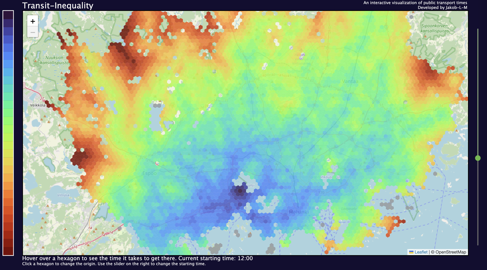

# Transit-Inequality
This project was conducted in the course CS-E4450 - Explorative Information Visualization @ Aalto University in the autumn semester 2022. Tomi Kauppinen (the teacher) wanted us to pick one of the 17 UN Sustainable Development Goal and create a visualization around that topic. I pick goal 11 'Make cities and human settlements inclusive, safe, resilient and sustainable'. My visualization offers a colored map based on how long it takes to traverse a city by public transport.

The user can select the starting point and starting time themselves. As a proof of concept I used the city of Helsinki, since I lived there at the time of development. If you want to try it, you can do so [via my website](https://www.jakob-l-m.de/transit-inequality.html) For a detailed explanation see `report.pdf`.
